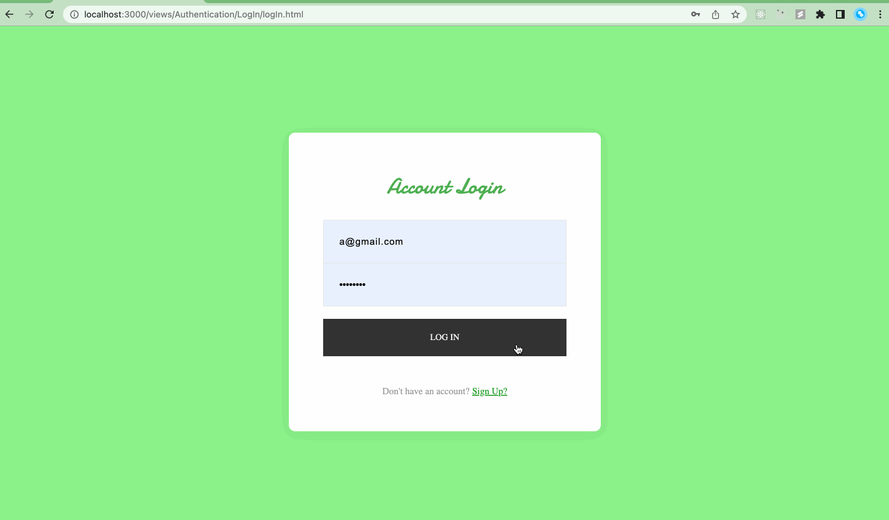

# SpartaHack - Barter

Why trash it if for nothing when you can exchange it for something? **Barter** connecting you with people who would exchange your guitar sitting in your attic for 9 momths that you never used for something you would use.

## Motivation

[This Youtube video](https://www.youtube.com/watch?v=Gxb3L8d0UtY) is the motivation to create **Barter**. However, **Barter** is more than just a challenge. It is the bridge to connect people, make new friend, and most important, reduce the amount of trash. Giving your old stuffs instead of throwing them away. It keeps us Green!

## Future features

- [ ] Customize homepage to display product based on user's interests and location.
- [ ] Evaluate product's value to increase the matching chance.

## Technology

Barter is created using Node.js and Firebase.

## Set up

Run the following commands:

```
npm install
node app.js
```

The website will be ready at http://localhost:3000/. The account for testing is below:

```
Email: b@gmail.com
Password: 123456
```

## Demo

